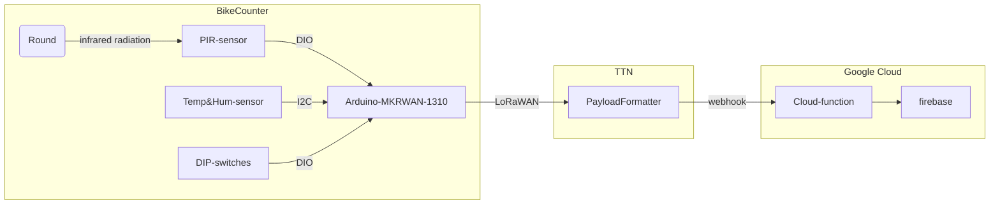
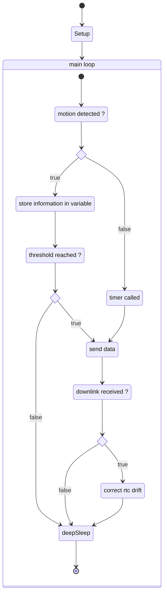

# BikeCounter  <!-- omit in toc -->

This repository contains the hardware and software components of a [PIR](https://en.wikipedia.org/wiki/Passive_infrared_sensor) based tracking device to monitor the usage of local bike trails. The data is sent over [LoRaWAN](https://de.wikipedia.org/wiki/Long_Range_Wide_Area_Network) to [TTN](https://www.thethingsnetwork.org/) and from there to a [Google Cloud](https://console.cloud.google.com) backend which stores the data and provides api endpoints for the data visualization web UI ([bikeCounterUI](https://github.com/guidosch/bikecounterUI)).

 
 

The repository is divided into two main sections. The first one contains all the data regarding the hardware components and the second one holds the software code.

- [Hardware](#hardware)
- [Software](#software)
  - [Overview](#overview)
  - [BikeCounter](#bikecounter)
    - [Overall state machine](#overall-state-machine)
    - [Data package](#data-package)
    - [Time scheduler](#time-scheduler)
    - [Device configuration](#device-configuration)
    - [Unit tests](#unit-tests)
    - [To be aware of](#to-be-aware-of)
  - [TTN](#ttn)
  - [Google Cloud](#google-cloud)
- [Contributing](#contributing)
- [License](#license)

# Hardware

The core component of the device is an [Arduino MRKWAN 1310](https://docs.arduino.cc/hardware/mkr-wan-1310) which sits on the "logic layer" PCB. This PCB connects the micro controller to the sensors, the dip switches and the "power layer" PCB.

To detect the movement a PIR sensor from [Seeed Studio](https://www.seeedstudio.com/Grove-PIR-Motion-Sensor.html) is used and to monitor the internal environment of the device a temperature and humidity sensor from [Adafruit](https://www.adafruit.com/product/3721) was chosen.

The "power layer" PCB holds two rechargeable lithium-ion batteries (18650). This allows the device to run up to one year without exchanging the batteries.

The schematics and layout files of the PCBs as well as the BOM of the whole device can be found in the corresponding subfolder.

# Software

This Repository contains the code for the tracking device as well as the scripts running on the backend.

## Overview

## BikeCounter

There are two versions of the main BikeCounter software. The **light** version is a simple and basic implementation of the needed functionality. The **pro** version has extended features that allow it to take track of time as well as its environnement conditions.

(Due to the fact that the light version is almost obsolete only the pro version will be explained in more detail.)

### Overall state machine

After the main loop finishes the device goes into a deepSleep mode. From there the PIR sensor or the rtc timer can wake it back up and trigger the main loop again.

### Data package

The payload size of one single LoRaWAN data package is restricted to 51 bytes. To avoid multi-package messages and to reduce transmission time an optimized information transmission protocol was developed.

The dataPackage class handles all the information conversion and encoding. A detailed documentation of the protocol can be found in the dataPackage.xlsx file.

**Payload encoding**

| address bits | 0-7 [8] | 8-11 [4]      | 12-15 [4]     | 16-18 [3] | 19-23 [5]    | 24-27 [5] | 28-30 [3] | 31-54 [24] | 55-57 [3]   | 58-62 [5]    | 63-408 [6/7/8/9/10] |
| --------------- | ---------- | ---------------- | ---------------- | ------------ | --------------- | ------------ | ------------ | ------------- | -------------- | --------------- | ---------------------- |
| **content**     | count      | software version | hardware version | status index | battery voltage | temperature  | humidity     | device time   | interval index | hour of the day | offset minutes array   |

The data type size of the offset array depends on the selected interval.

### Time scheduler

During the night as well as the cold seasons of the year the data transmission interval can be adjusted to save energy and transmission time. The timeScheduler class provides all the necessary methods to accomplish such a dynamic behavior.

### Device configuration

The configuration information to establish a connection to the TTN (AppEUI and AppKey) is saved to the flash memory of the Arduino MKRWAN 1310. The `writeConfigToFlash.ino` script saves a new configuration to the memory.

### Unit tests

This repository contains serval unit tests for the dataPackage and the timeScheduler class. The tests are written using the [Google Test](https://google.github.io/googletest/) framework. A cMake configuration for local testing is provided as well as an automated CI pipeline for the master branch. The `runTestsLocal.sh` script executes all the commands needed to run the unit tests locally.

### To be aware of

- The LoRa module is very timing sensitive. That is the reason there are so many delays in the code to give it enough time to wait for messages and to response.

- The first time the (deep)sleep method is called, it re-initializes the RTC to a wrong value. To fix this issue the first iteration of the main loop puts the device into the sleep mode for a short period of time and resets the RTC in the next loop.

## TTN

The message from the device gets over LoRaWAN to the TTN server where a uplink payload formatter parses the data bytes to a human readable JavaScript object. The server then triggers a webhook and passes the data object to the Google Cloud function API endpoint.

The downlink message with the time drift information will also be parsed by the payload formatter defined in TTN.

The up/down-link payload formatter scripts are stored in the TTN subfolder.

## Google Cloud

The triggered cloud function evaluates the data object sent from TTN and saves it to the Firebase database. Depending on the difference between the local time of the device and the server time it schedules a downlink message to correct the internal device time.

There are also cloud functions that provide an API endpoint for the web UI ([bikeCounterUI](https://github.com/guidosch/bikecounterUI)) to visualize the stored data.

# Contributing

Pull requests are welcome. For major changes, please open an issue first to discuss what you would like to change.

Please make sure to update the tests as appropriate.

# License

This project is licensed under [CC0-1.0](LICENSE)
