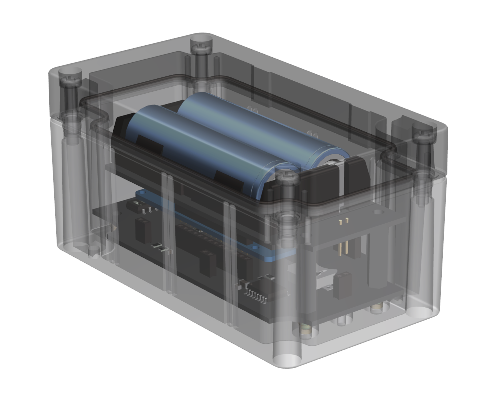
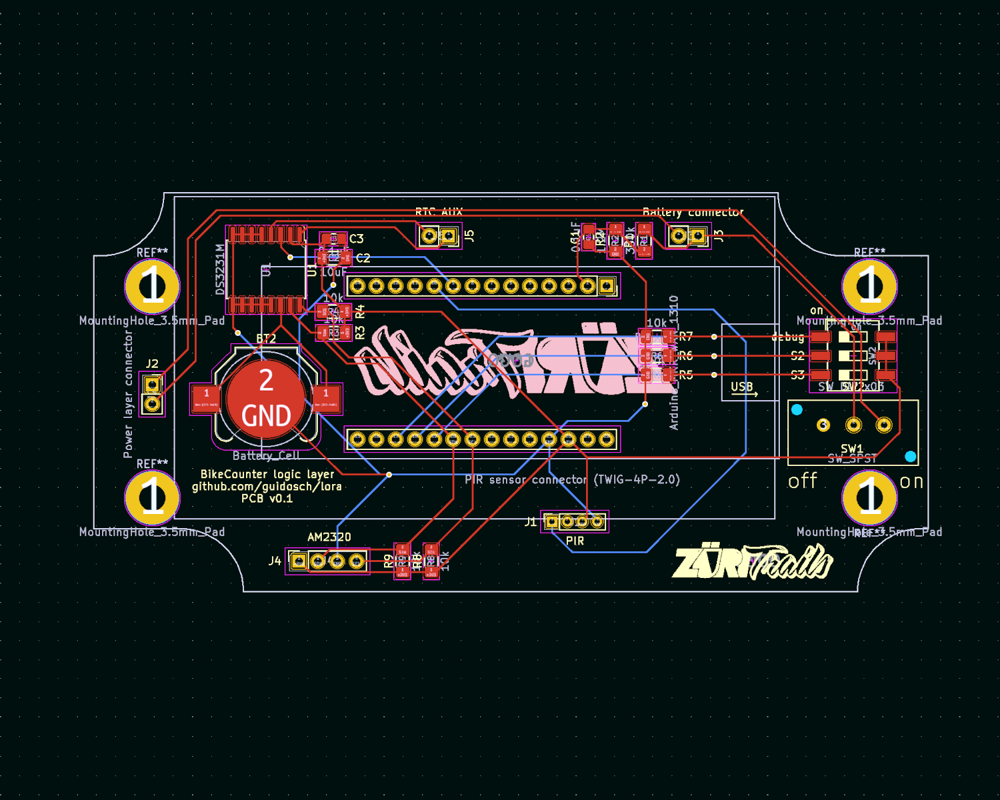
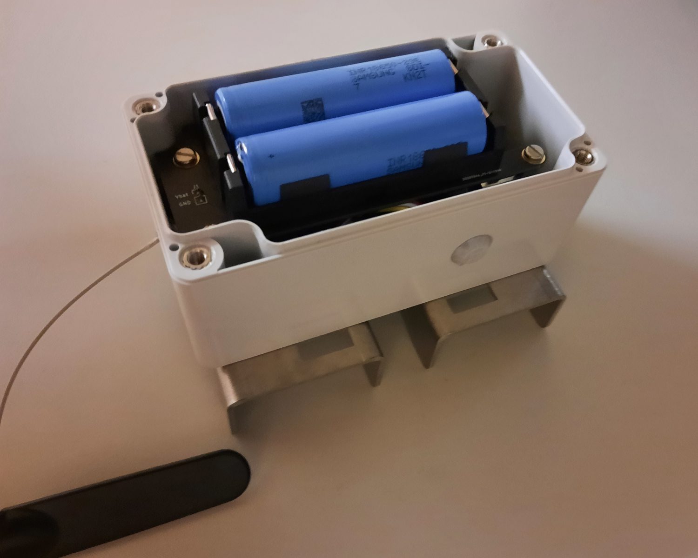
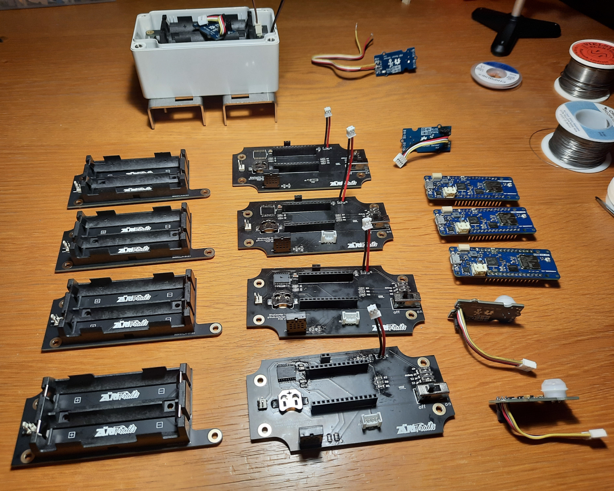

# BikeCounter

This repository contains the hardware and software components of a [PIR](https://en.wikipedia.org/wiki/Passive_infrared_sensor) based tracking device to monitor the usage of local bike trails. The data is sent over [LoraWAN](https://de.wikipedia.org/wiki/Long_Range_Wide_Area_Network) to [TTN](https://www.thethingsnetwork.org/) and from there to a [Google cloud](https://console.cloud.google.com) backend which stores the data and provides api endpoints for the data visualization web UI ([bikeCounterUI](https://github.com/guidosch/bikecounterUI)).

 
 

The repository is divided into two main sections. The first one contains all the data regarding the hardware components and the second one holds the whole software code.

## Hardware
The core component of the device is an [Arduino MRKWAN 1310](https://docs.arduino.cc/hardware/mkr-wan-1310) which sits on the "logic layer" PCB. This PCB connects the micro controller to the sensors, the dip switches and the "power layer" PCB.

To detect the movement a PIR sensor from [Seeed Studio](https://www.seeedstudio.com/Grove-PIR-Motion-Sensor.html) is used and to monitor the internal environment of the device a temperature and humidity sensor from [Adafruit](https://www.adafruit.com/product/3721) was chosen. 

The "power layer" PCB holds up to two rechargeable lithium-ion batteries (18650). This allows the device to run up to one year without exchanging the batteries.

The schematics and layout files of the PCBs as well as the BOM of the whole device can be found in the corresponding subfolder.

## Software
This Repository contains the code for the tracking device as well as the scripts running on the backend.

**Overview**

